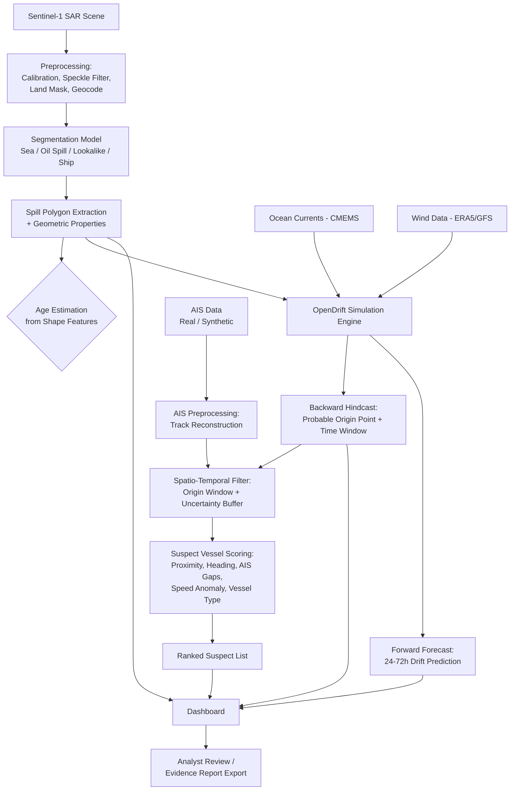

# Project Workflow — Oil Spill Detection & Vessel Attribution System
### SIH PS #26143

---

## 1. High-Level Pipeline



---

## 2. Module-by-Module Workflow

### Module A: Detection & Characterization
**Input:** Raw Sentinel-1 SAR GRD product (.SAFE format)
**Steps:**
1. Radiometric calibration (convert digital numbers → backscatter values, sigma-nought).
2. Speckle filtering (e.g., Lee filter) — SAR images are inherently noisy.
3. Land/coastline masking (use a coastline shapefile so land isn't misclassified as spill).
4. Geocoding — reproject to a standard CRS (e.g., WGS84) so it aligns with other layers.
5. Feed the preprocessed raster into the trained segmentation model.
6. Model outputs a per-pixel class mask: `sea`, `oil_spill`, `lookalike`, `ship`.
7. Vectorize the `oil_spill` mask into polygon(s) using contour extraction (OpenCV `findContours` or `rasterio.features.shapes`).
8. Compute geometry: area, perimeter, centroid, elongation ratio, orientation.
9. (Optional) Classify age bucket using elongation/fragmentation heuristics — freshly spilled oil tends to be more compact; as it weathers and spreads it elongates and fragments under wind/current shear.

**Output:** GeoJSON polygon(s) with properties `{area_km2, centroid, orientation, timestamp, confidence}`.

---

### Module B: Drift Hindcasting & Forecasting
**Input:** Spill polygon + timestamp (from Module A), ocean current field, wind field.
**Steps:**
1. Pull ocean surface current data (u/v components) from CMEMS for the scene's time and bounding box.
2. Pull wind data (u/v at 10m) from ERA5/GFS for the same window.
3. Seed a set of "virtual particles" across the spill polygon in OpenDrift's `OpenOil` module (purpose-built for oil weathering + drift — includes evaporation, emulsification, dispersion physics).
4. Run the simulation **backward in time** from the detection timestamp (e.g., 48-72h back) → cluster of end positions gives a probable origin **area** and **time window** (not a single point — express as a probability heatmap or bounding ellipse).
5. Run the simulation **forward in time** from the detection timestamp for the forecast horizon (24-72h) → predicted future spread.
6. Output both trajectories as time-stamped point sets (for animation) and as bounding polygons per time step (for uncertainty visualization).

**Output:** `{origin_estimate: {polygon, time_window}, forecast_track: [{time, polygon}]}`

---

### Module C: AIS-Based Attribution
**Input:** Origin estimate (space + time window) from Module B, AIS dataset.
**Steps:**
1. Load AIS data (real historical CSV from MarineCadastre-style schema, or synthetic generator for the demo region).
2. Reconstruct continuous vessel tracks from raw AIS pings (group by MMSI, sort by timestamp, interpolate gaps).
3. **Spatial filter:** keep only vessels whose track intersects the origin-estimate polygon (expanded by a buffer to account for drift-model uncertainty).
4. **Temporal filter:** keep only vessels present during the origin time window (expanded by a margin, e.g., ±3-6h).
5. For each surviving candidate vessel, compute sub-scores:
   - **Proximity score:** inverse distance from vessel's closest track point to the estimated origin centroid.
   - **Temporal score:** inverse time-offset between vessel's presence and the estimated origin time.
   - **Trajectory alignment score:** does the vessel's heading/course at that time point in a direction consistent with the current+wind vector that would carry oil to the detected spill location?
   - **Anomaly score:** flag AIS transmission gaps ("going dark"), abrupt speed drops (consistent with slowing to discharge/flush tanks), or deviation from the vessel's typical shipping lane — all classic discharge-behavior indicators used in real maritime enforcement.
   - **Vessel-type prior:** weight tankers/cargo vessels higher than passenger/fishing vessels if AIS static data (ship type) is available.
6. Combine into a weighted composite suspicion score, normalize 0-100.
7. Rank vessels, output top-N with each sub-score shown for explainability.

**Output:** Ranked list `[{mmsi, vessel_name, suspicion_score, sub_scores: {...}, track_geojson}]`.

---

### Module D: Visualization Dashboard
**Steps:**
1. Base map (OpenStreetMap/Mapbox tiles) centered on the incident region.
2. Overlay: SAR scene thumbnail, detected spill polygon (highlighted).
3. Overlay: backward hindcast path (dashed, uncertainty ellipse) and forward forecast path (solid, fading confidence with time).
4. Overlay: AIS tracks of top suspect vessels, color-coded by suspicion score.
5. Timeline slider to animate the drift over time.
6. Side panel: spill properties card, ranked suspect table with expandable evidence breakdown per vessel.
7. "Export Report" button → generates a PDF/JSON evidence summary for the incident.

---

## 3. Data Flow Summary

```
Sentinel-1 SAR → Preprocessing → Segmentation Model → Spill Polygon
                                                            │
                CMEMS Currents + ERA5 Wind ─────────► OpenDrift Engine
                                                            │
                                        ┌───────────────────┴───────────────────┐
                                  Backward Hindcast                     Forward Forecast
                                  (Origin Window)                       (Future Spread)
                                        │
                        AIS Data → Track Reconstruction → Spatio-Temporal Filter
                                        │
                              Suspect Scoring & Ranking
                                        │
                                   Dashboard / Report
```

---

## 4. Key Design Decisions to Document in Your Demo

- **Why OpenDrift?** It's a peer-reviewed, widely used open-source ocean trajectory model (used by real oil-spill response agencies) with a dedicated `OpenOil` module for oil weathering physics — using it (vs. a hand-rolled drift model) adds scientific credibility to your solution.
- **Why express origin as a window, not a point?** Environmental data resolution and model uncertainty mean a single-point claim would be scientifically dishonest. A probability area/time-window is both more defensible and more realistic for judges familiar with oceanography.
- **Why explainable scoring over a black-box ML classifier for attribution?** Because the output feeds into a potential enforcement action — each suspicion score must be traceable to interpretable evidence (proximity, timing, behavior anomalies).
